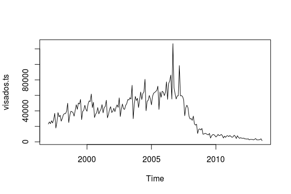
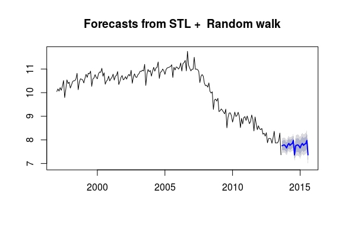
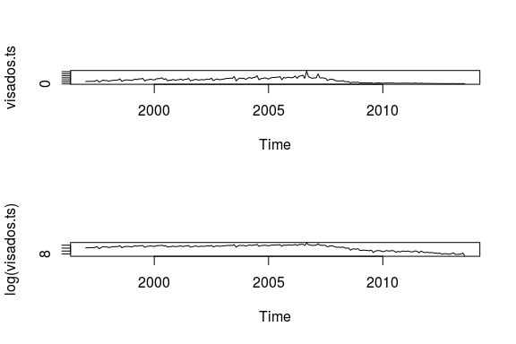
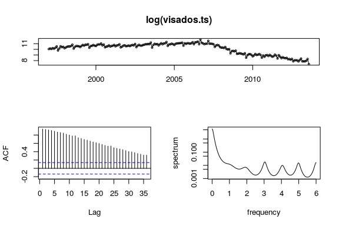
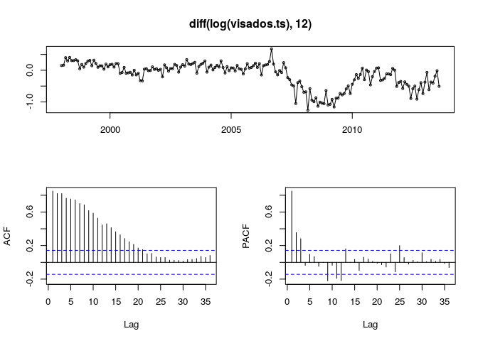
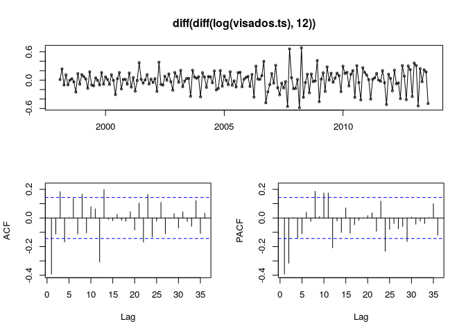
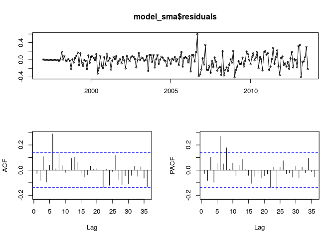
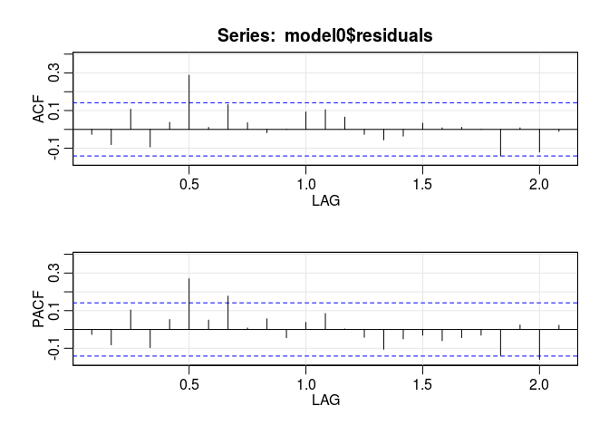

Modeling the Spanish new housing approvals as a Time Series
================

``` r
library(forecast)
library(astsa)
library(tseries)
library(car)

# User-defined function to obtain the best ARIMA model.
source("../src/getBestArima.R")
```

The following is an analysis of time series data reflecting the number of new housing approvals per month over a timespan ranging from January 1997 to August 2013, as measured by the Spanish institution Banco de España (www.bde.es)

Loading the data
----------------

``` r
visados.df <- read.csv("../data/data_g2.csv", header=T, sep=",", stringsAsFactors = FALSE)
# Create a Time Series object, starting from 1997 and seasonal data.
visados.ts <- ts(visados.df$Visados, start=c(1997,1), end=c(2013, 8), frequency = 12)
```

Time series description
-----------------------

Let us begin by plotting the series to have a quick overview of its characteristics:

``` r
# Plot original data.
plot(visados.ts)
```



At first glance, we can confirm that the data is not stationary. The series show an ascending trend during the first years, when there also seems to be a possible annual seasonal component. Around 2007, however, there is a radical drop in housing approvals and the trend changes to a slightly descending one. The reason for this is most likely to be the economic crisis which Spain suffered, whose effects began being noticeable around these dates.

Decomposition of the time series
--------------------------------

Decomposition methods describe the trend and seasonal factors in a time series. We will use this information for understanding the data at hand before building a more sophisticated model, for instance, an ARIMA model.

The Multiplicative decomposition is one of the basic decomposition methods and it is useful when the seasonal variance of the data increases over time. As we will see in the further analysis, such hypothesis will be closer to the structure of the dataset than the simple Additive decomposition. The Multiplicative decomposition method is defined as:


where *x*<sub>*t*</sub> is the time series at time *t*, *T*<sub>*t*</sub> is the trend, *S*<sub>*t*</sub> is the seasonality and *I*<sub>*t*</sub> is the irregular part or remainder. Essentially, the goal is to find a decomposition such that the remainder behaves like white noise, that is to say, the remainder acts as a stationary time series by itself.

There are different ways to model the trend and the seasonality components. R provides the <i>stl()</i> function for seasonal decomposition of time series based on LOESS, a smoothing procedure that is based on local, weighted robust regression. The aim of this procedure is to reduce potentially the disturbing influence of outliers. By default, the command <i>stl()</i> performs an additive decomposition but it can be easily transformed to a multiplicative decomposition taking logarithm of the input data.

``` r
# Multiplicative decomposition
visados.stl <- stl(log(visados.ts), s.window="periodic")
plot(visados.stl)
```


The second parameter essentially controls the seasonal effects to be estimated in as averages of de-trended values. The plot shows the observed series, the seasonal pattern, the smoothed trend line, and the remainder part of the series. Note that the seasonal pattern is a regularly repeating pattern. The grey bars facilitate the interpretation by covering the same span of the *y*-scale in all the charts.

Nevertheless, the remainder does not look like white noise. Looking at the ACF plot, some significant autocorrelation coefficients can be distinguished outside the limits. Then, there is still information left in the remainder that should be used in computing forecasts.

``` r
# Extracting and ploting the remainder part.
visados.stl.remainder <- visados.stl$time.series[,c("remainder")]
tsdisplay(visados.stl.remainder)
```


The further assumption is checked using the Box-Pierce test for examining the null hypothesis of independence in the remainder. The *p*-value is close to 0 and hence there exist significant autocorrelations for the first 12 lags.

``` r
# Box-Pierce test for independence of a time series.
Box.test(visados.stl.remainder, lag=12) 
```

    ## 
    ##  Box-Pierce test
    ## 
    ## data:  visados.stl.remainder
    ## X-squared = 35.136, df = 12, p-value = 0.0004454

Let us forecast future values based on the last analysis of the trend and seasonal factors. The seasonality factor can be identified, but the trend is not clear.

``` r
# Forecasting new values.
plot(forecast(visados.stl, method="naive"))
```



<!-- If there are space, plotting the original series and the seasonal adjusted one, to see the trend

```r
par(mfrow=c(2,1))
plot(visados.ts)
plot(exp(seasadj(visados.stl))) 
```


-->
ARIMA Model
-----------

### Description

The next step will be to fit an ARIMA model to our time series. These kind of models are the most general class of time series models, and can be used for forecasting. Quoting Robert Nau, <i>'an ARIMA model can be viewed as a “filter” that tries to separate the signal from the noise, and the signal is then extrapolated into the future to obtain forecasts'</i>.

### Data transformation

First of all, let us decide on whether to use the original variable or to work with the log transformation of it. The log transformation might improve the stationary of the time series. We will select the latter option if the amplitude of the seasional changes increases with the overall trend, that is, if the variance is not constant across the series. In the following figure you can observe that the shape of the log plot is smoother and its variance is more stable than the original variable. Therefore we will use the log of the house sales variable from now on. Notice that the Box Cox transformation suggests to use a lambda close to 0 too.



### Seasonality

The nature of the dataset leads us to think about setting an anual seasonal component, *s* = 12. However, analyzing the periodogram of the below figure, we cannot observe an evident seasonal component. The high peak at point 0 of the *x*-axis is related to a long, infinite repeated cycle over the time. The next highest peak should be at point 1 to observe a 12-monthly seasonality, but this is not the case. On the other hand, the <i>seasonplot()</i> and <i>monthplot()</i> functions might help us identifying this lack of seasonality. Firstly, the seasonal plot shows how the ups and downs are similar over the years, with the lines being almost parallel. Secondly, the month plot reveals a strong seasonal pattern in August, where the sales decay. This drop should be adjusted into the model if we would like to see whether if there is a real trend of house sales going down in August.

Should we consider a whole seasonal component just for this August change? Based on the last hypothesis, we should say no. However, as we will see in the following section, there exists a clear fact to assume seasionality.

``` r
# Periodogram of the time series.
tsdisplay(log(visados.ts), plot.type = "spectrum")
```



``` r
# Season and month plots.
par(mfrow=c(1,2))
seasonplot(log(visados.ts))
monthplot(log(visados.ts))
```


### Differencing

The next step in fitting an ARIMA model is to detect the order of differencing needed to make the time series stationary. We will employ the <i>adf.test</i> function to check stationarity, and the standard deviation values to set the stop condition (the lower, the better.)

Let us suppose that we omit the seasonality analysis from the last section. Since the original ACF plot has positive autocorrelations out to a high number of lags, we will apply one order of diferencing.

``` r
# Initial standard deviation
sd(log(visados.ts))
```

    ## [1] 1.006753

``` r
# One order of differencing.
sd(diff(log(visados.ts)))
```

    ## [1] 0.2719039

``` r
# Augmented Dickey–Fuller Test for stationarity.
adf.test(diff(log(visados.ts)))
```

    ## 
    ##  Augmented Dickey-Fuller Test
    ## 
    ## data:  diff(log(visados.ts))
    ## Dickey-Fuller = -7.5577, Lag order = 5, p-value = 0.01
    ## alternative hypothesis: stationary

``` r
# ACF and PACF of the differentiated time series.
tsdisplay(diff(log(visados.ts)))
```


We achieve stationarity because we have evidence to reject the null hypothesis in favor of the alternative hypothesis of stationarity in the Augmented Dicket-Fuller test (*p*-value &lt;&lt; 0.01). Let us check if we need another order of differencing:

``` r
# Two orders of differencing.
sd(diff(diff(log(visados.ts))))
```

    ## [1] 0.4600476

The answer is no, since the standard deviation increases. However, notice the high peaks of autocorrelations in the lags 12, 24 and 36 in the latter plot. This is a clear evidence of 12-monthly seasonality. Therefore, we omit this first step and we apply directly a first seasonal difference in order to see if the time series is described by a seasonal random walk.

``` r
# One order of seasonal differencing.
sd(diff(log(visados.ts), 12))
```

    ## [1] 0.39003

``` r
# Checking stationarity
adf.test(diff(log(visados.ts), 12))
```

    ## 
    ##  Augmented Dickey-Fuller Test
    ## 
    ## data:  diff(log(visados.ts), 12)
    ## Dickey-Fuller = -1.8166, Lag order = 5, p-value = 0.6529
    ## alternative hypothesis: stationary

``` r
# ACF and PACF of the seasonal differentiated time series.
tsdisplay(diff(log(visados.ts), 12))
```



A seasonal random walk is defined as  , where  is the average annnual trend. In this case, there is not evidence to reject the null hypothesis in the <i>adf.test()</i>. Besides, the ACF plot still has many positive autocorrelations. As we have already seen, this is an evidence to apply one order of non-seasonal difference.

``` r
# One order of non seasonal differencing and one order of seasonal differencing.
sd(diff(diff(log(visados.ts), 12)))
```

    ## [1] 0.2116118

``` r
adf.test(diff(diff(log(visados.ts), 12)))
```

    ## 
    ##  Augmented Dickey-Fuller Test
    ## 
    ## data:  diff(diff(log(visados.ts), 12))
    ## Dickey-Fuller = -6.8037, Lag order = 5, p-value = 0.01
    ## alternative hypothesis: stationary

``` r
tsdisplay(diff(diff(log(visados.ts), 12)))
```



We obtain stationarity again, with a lower standard deviation than the simple model with just one order of non-season differencing (0.211 &lt; 0.27), and now the peaks in the lags 12 and 24 are considerably smaller. The times series is now modeled as a seasonal random trend. Comparing this model with the previous seasonal random walk, they both predict that next year's seasonal cycle will have the same pattern. In contrast, the seasonal random trend considers that the future trend will be equal to the <i>most recent</i> year-to-year trend, instead of the <i>average</i> year-to-year trend ( in the model). The seasonal random trend is defined as , which is equivalent to an  model.

To conclude, we stop here since another order of differencing does not improve the standard deviation.

``` r
# Standard deviation.
sd(diff(diff(diff(log(visados.ts), 12))))
```

    ## [1] 0.3522928

#### ndiffs and nsdiff (forecast package)

Let us study what values of differencing the functions <i>ndiffs</i> and <i>nsdiffs</i> suggest. These results should be taken with a grain of salt and only be used to support our analysis.

``` r
# Built-in functions to calculate the number of differences required for a stationary series.
# KPSS test.
ndiffs(log(visados.ts), test="kpss")
```

    ## [1] 2

``` r
# ADF test.
ndiffs(log(visados.ts), test="adf")
```

    ## [1] 1

``` r
# Seasional differences.
nsdiffs(log(visados.ts), m=12)
```

    ## [1] 0

Surprisingly, depending on the test we use to estimate the number of differences required to make the time series stationary, we obtain a different value. This extra differencing order is a particular case where the KPSS test detects that the first order difference of the time series is still not stationary but trend-stationary, and another order of differencing is needed. In contrast, the ADF test rejects the null hypothesis of presence of a unit root against a stationary root alternative. On the other hand, <i>nsdiffs</i> indicates that we do not need any order of seasonal differencing.

### AR and MA terms

Once your time series time series has been stationarized by differencing, the next step in fitting an ARIMA model is to correctly set whether AR or MA terms are needed to correct any autocorrelation that still remains in the differenced series. This task might be achieved by looking at the ACF and PACF plots of the differenced series.

An MA term is needed when a negative autocorrelation at lag 1 appears, that is, it tends to arise in series which are slightly overdifferenced. The reason for this is that an MA term can "partially cancel" an order of differencing in the forecasting equation. Let us add a non-seasonal MA term:

``` r
# ARIMA(0,1,1)(0,1,0)
model_ma = Arima(log(visados.ts), order=c(0,1,1), seasonal=list(order=c(0,1,0), period=12))
tsdisplay(model_ma$residuals)
```


We now identify a high peak at lag 12 in the ACF plot. If the autocorrelation at the seasonal period is positive, consider adding a seasonal AR term to the model. On the other hand, if the autocorrelation at the seasonal period is negative, consider adding a seasonal MA term to the model. Let us add a seasonal MA term:

``` r
# ARIMA(0,1,1)(0,1,1)
model_sma = Arima(log(visados.ts), order=c(0,1,1), seasonal=list(order=c(0,1,1), period=12))
tsdisplay(model_sma$residuals)
```



Despite the presence of some autocorrelation, the remanining residuals look nice. These peaks do not mean that the model is wrong, as they might appear even in simulated time series models. The obtained  model is essentially a "seasonal exponential smoothing model", which equation is:


where *θ*<sub>1</sub> is the MA(1) coefficient and *Θ*<sub>1</sub> is the SMA(1) coefficient.

### Statistical Assumptions

Before continuing, lets analyze if the obtained model meets the assumptions in order to study its validation. Independence of the residuals is particularly important in order to ensure the correctness in the predictions. Having a mean of zero is also relevant, but can be fixed if it is not met. If the residuals have a mean different from zero, then an option is to simply add the mean to all forecasts. This way the bias problem can be solved. Finally, the normality will not only guarantee the independence of the residuals but also will valid the confidence intervals, since the hypothesis to calculate these intervals are based on the normal distribution.

A brief comment on the parameters of the <i>Box.test</i> function. R. Hyndman and G. Athanasopoulos recommend to use *l**a**g* = 10 for non-seasonal data and *l**a**g* = 2*m* for seasonal data, where *m* is the period of seasonality, therefore *l**a**g* = 24 was chosen here. As for the *f**i**t**d**f* parameter, it refers to "the number of degrees of freedom to be subtracted if *x* is a series of residuals", in our case *f**i**t**d**f* = *p* + *q* + *P* + *Q* = 2.

``` r
# ARIMA(0,1,1)(0,1,1)
model0 = Arima(log(visados.ts), order=c(0,1,1), seasonal=list(order=c(0,1,1), period=12))
# One-sample t-test
t.test(model0$residuals)
```

    ## 
    ##  One Sample t-test
    ## 
    ## data:  model0$residuals
    ## t = -2.0892, df = 199, p-value = 0.03796
    ## alternative hypothesis: true mean is not equal to 0
    ## 95 percent confidence interval:
    ##  -0.043298218 -0.001250193
    ## sample estimates:
    ##   mean of x 
    ## -0.02227421

``` r
# Box-Pierce test
Box.test(model0$residuals, lag=24, fitdf=2)
```

    ## 
    ##  Box-Pierce test
    ## 
    ## data:  model0$residuals
    ## X-squared = 39.066, df = 22, p-value = 0.01387

``` r
# Jarque bera test for normality
jarque.bera.test(model0$residuals)
```

    ## 
    ##  Jarque Bera Test
    ## 
    ## data:  model0$residuals
    ## X-squared = 10.205, df = 2, p-value = 0.006082

Results show that the residuals do not have zero mean and are not independent (the *p*-value resulting from the Box-Pierce test conducted on them is low enough to reject the null hypothesis of independence, but is not extremely low, however). The Jarque-Bera test indicates that these residuals are also not normal. Outliers can noticeably alter the results of this test, so lets try again, removing the greatest outlier this time.

``` r
# Checking normality without greatest outlier.
which.max(model0$residuals)
```

    ## [1] 117

``` r
jarque.bera.test(model0$residuals[-117])
```

    ## 
    ##  Jarque Bera Test
    ## 
    ## data:  model0$residuals[-117]
    ## X-squared = 2.9934, df = 2, p-value = 0.2239

As the new *p*-value shows, there is no evidence to reject the null hypothesis now. Therefore, residuals can indeed be considered normal if this outlier is not taken into account. Moreover, as the plot below shows, ACF and PACF functions of the residuals behave decently, only showing one relevant spike each (ideally, all spikes would be within the limits, but given that we are dealing with real world data, this results can be considered valid).

``` r
res = acf2(model0$residuals)
```



### Improving ARIMA models

The ARIMA model we have until now has some upsides, in the sense that a) it is simple parameter-wise, b) was obtained following the theory and c) residuals meet most of the assumptions. Independence of these, however, has not been achieved. Because of this fact and because ARIMA models are hard to fit, a couple alternative methods for parameter tuning have been tried next. We have implemented a user-defined method to iterate over different ARIMA models, where we can specify some default minimum parameters or if the statistical assumptions should be met or not. For further indications, refer to the `getBestArima.R` script in the `src` folder.

#### Alternative 1: Improving based on RMSE

A reasonable approach is to try and find a model which offers a lower RMSE than the one we have until now (roughly, for our first model, RMSE = 0.152). Along this line, maintaining at least the already calculated parameters, we tuned them increasing their values one by one. The result was the following model, an .

``` r
# "Best RMSE model" maintaining some fixed parameters.
# ARIMA(2,1,1)(1,1,1)
model1 = Arima(log(visados.ts), order=c(2,1,1), seasonal=list(order=c(1,1,1), period=12))
summary(model1)
```

    ## Series: log(visados.ts) 
    ## ARIMA(2,1,1)(1,1,1)[12]                    
    ## 
    ## Coefficients:
    ##           ar1      ar2     ma1    sar1     sma1
    ##       -0.6702  -0.3661  0.2018  0.2344  -0.9306
    ## s.e.   0.2277   0.0985  0.2445  0.1015   0.1279
    ## 
    ## sigma^2 estimated as 0.02328:  log likelihood=79.72
    ## AIC=-147.44   AICc=-146.97   BIC=-128.05
    ## 
    ## Training set error measures:
    ##                      ME      RMSE       MAE        MPE    MAPE      MASE
    ## Training set -0.0212474 0.1455423 0.1059706 -0.2268151 1.07766 0.3580703
    ##                     ACF1
    ## Training set -0.02377636

``` r
t.test(model1$residuals)
```

    ## 
    ##  One Sample t-test
    ## 
    ## data:  model1$residuals
    ## t = -2.0817, df = 199, p-value = 0.03865
    ## alternative hypothesis: true mean is not equal to 0
    ## 95 percent confidence interval:
    ##  -0.041374543 -0.001120266
    ## sample estimates:
    ##  mean of x 
    ## -0.0212474

``` r
Box.test(model1$residuals, lag=24, fitdf=5)
```

    ## 
    ##  Box-Pierce test
    ## 
    ## data:  model1$residuals
    ## X-squared = 29.259, df = 19, p-value = 0.06202

``` r
# Find the outlier and remove it
jarque.bera.test(model1$residuals[-which.max(model1$residuals)])
```

    ## 
    ##  Jarque Bera Test
    ## 
    ## data:  model1$residuals[-which.max(model1$residuals)]
    ## X-squared = 4.8968, df = 2, p-value = 0.08643

Assumptions-wise this model performs better than the previous one. While residuals still do not have a mean of zero, results of the Box-Pierce and Jarque-Bera tests (the latter after ruling out the outlier at position 117) show that they are independent and normal. Moreover, root mean squared error has been reduced, achieving a slightly lower RMSE = 0.146, and AIC is also somewhat lower. The downside of this model is complexity, as it uses more complex parameters than the previous one, and the gain in terms of assumptions or RMSE is arguably not significant enough to make up for that fact.

#### Alternative 2: Improving based on hypothesis-meeting

This time, priority has been given to finding a model which fullfills all the hypothesis, that is, one which guarantees that residuals are independent, normal, and have zero mean. Within this subset of models, we have chosen the one with lowest RMSE: an .

``` r
# "Best RMSE model" in terms of hypothesis.
# ARIMA(1,2,2)(1,0,2)
model2 = Arima(log(visados.ts), order=c(1,2,2), seasonal=list(order=c(1,0,2), period=12))
summary(model2)
```

    ## Series: log(visados.ts) 
    ## ARIMA(1,2,2)(1,0,2)[12]                    
    ## 
    ## Coefficients:
    ##          ar1      ma1     ma2    sar1     sma1     sma2
    ##       0.1822  -1.7478  0.8112  0.9998  -0.8128  -0.1624
    ## s.e.  0.1096   0.0781  0.0769  0.0010   0.0965   0.0887
    ## 
    ## sigma^2 estimated as 0.02139:  log likelihood=85.17
    ## AIC=-156.35   AICc=-155.76   BIC=-133.33
    ## 
    ## Training set error measures:
    ##                        ME      RMSE      MAE         MPE     MAPE
    ## Training set 0.0009797014 0.1432831 0.105916 0.007664821 1.072931
    ##                   MASE         ACF1
    ## Training set 0.3578858 0.0004894731

``` r
t.test(model2$residuals)
```

    ## 
    ##  One Sample t-test
    ## 
    ## data:  model2$residuals
    ## t = 0.096457, df = 199, p-value = 0.9233
    ## alternative hypothesis: true mean is not equal to 0
    ## 95 percent confidence interval:
    ##  -0.01904913  0.02100853
    ## sample estimates:
    ##    mean of x 
    ## 0.0009797014

In this case, the zero mean of the residuals is within the confidence intervals of the one sample *t*-test, and we do not have evidence to reject the null hypothesis (*p*-value = 0.9233).

``` r
Box.test(model2$residuals, lag=24, fitdf=6, type="L")
```

    ## 
    ##  Box-Ljung test
    ## 
    ## data:  model2$residuals
    ## X-squared = 21.497, df = 18, p-value = 0.2551

``` r
# Remove the outlier and test again
jarque.bera.test(model2$residuals[-which.max(model2$residuals)])
```

    ## 
    ##  Jarque Bera Test
    ## 
    ## data:  model2$residuals[-which.max(model2$residuals)]
    ## X-squared = 4.9963, df = 2, p-value = 0.08224

All the assumptions are now met, with the residuals also being normal and independent. AIC and RMSE are also the lowest of all models. Surprisingly, this model contradicts the theoretical one in the sense that it does not include any seasonal differences, but in exchange it does feature seasonal AR(1) and MA(2). Finally, even the ACF and PACF functions display perfect behaviour, with no outstanding spikes, as the plot illustrates.

``` r
res = acf2(model2$residuals)
```


#### Alternative 3: auto.arima()

Package forecast comes with a function to automatically find the best ARIMA model. This function, however, is not very trustable, and its results have to be tested. The result is an .

``` r
# Auto Arima model.
model3 = auto.arima(log(visados.ts))
summary(model3)
```

    ## Series: log(visados.ts) 
    ## ARIMA(0,2,2)(0,0,2)[12]                    
    ## 
    ## Coefficients:
    ##           ma1     ma2    sma1    sma2
    ##       -1.6736  0.7371  0.4985  0.3038
    ## s.e.   0.0591  0.0636  0.0743  0.0817
    ## 
    ## sigma^2 estimated as 0.03289:  log likelihood=54.77
    ## AIC=-99.54   AICc=-99.23   BIC=-83.1
    ## 
    ## Training set error measures:
    ##                         ME      RMSE       MAE         MPE    MAPE
    ## Training set -0.0008835312 0.1786133 0.1357561 -0.02049749 1.37876
    ##                   MASE       ACF1
    ## Training set 0.4587145 0.01385903

``` r
t.test(model3$residuals)
```

    ## 
    ##  One Sample t-test
    ## 
    ## data:  model3$residuals
    ## t = -0.069781, df = 199, p-value = 0.9444
    ## alternative hypothesis: true mean is not equal to 0
    ## 95 percent confidence interval:
    ##  -0.02585128  0.02408422
    ## sample estimates:
    ##     mean of x 
    ## -0.0008835312

``` r
Box.test(model3$residuals, lag=24, fitdf=3)
```

    ## 
    ##  Box-Pierce test
    ## 
    ## data:  model3$residuals
    ## X-squared = 19.269, df = 21, p-value = 0.5679

``` r
# Remove the outlier and test again
jarque.bera.test(model3$residuals[-which.max(model3$residuals)])
```

    ## 
    ##  Jarque Bera Test
    ## 
    ## data:  model3$residuals[-which.max(model3$residuals)]
    ## X-squared = 9.914, df = 2, p-value = 0.007034

As seen above, the resulting model does have independent residuals, and their mean is very close to zero. However they are not normal, not even after removing the outlier. In addition, RMSE has increased from previous iterations, and AIC has increased drastically. All in all, there are better alternatives than this automatically fitted ARIMA.

Finally, we have summarized in the following table the principal ARIMA models that we have analyzed along the report, highlighting the accuracy and the met of the assumptions of the residuals:

<style type="text/css">
.tg  {border-collapse:collapse;border-spacing:0;}
.tg td{font-family:Arial, sans-serif;font-size:14px;padding:10px 5px;border-style:solid;border-width:1px;overflow:hidden;word-break:normal;}
.tg th{font-family:Arial, sans-serif;font-size:14px;font-weight:normal;padding:10px 5px;border-style:solid;border-width:1px;overflow:hidden;word-break:normal;}
.tg .tg-uqo3{background-color:#efefef;text-align:center;vertical-align:top}
.tg .tg-s6z2{text-align:center}
.tg .tg-baqh{text-align:center;vertical-align:top}
.tg .tg-hgcj{font-weight:bold;text-align:center}
.tg .tg-amwm{font-weight:bold;text-align:center;vertical-align:top}
.tg .tg-j4kc{background-color:#efefef;text-align:center}
</style>
<table class="tg">
<tr>
    <th class="tg-hgcj">Model</th>
    <th class="tg-hgcj">RMSE</th>
    <th class="tg-hgcj">Independence</th>
    <th class="tg-hgcj">Zero mean</th>
    <th class="tg-amwm">Normality</th>

</tr>
<tr>
    <td class="tg-s6z2">(0,1,1)(0,1,1)</td>
    <td class="tg-s6z2">0.152</td>
    <td class="tg-s6z2">no</td>
    <td class="tg-s6z2">no</td>
    <td class="tg-baqh">yes (outlier)</td>

</tr>
<tr>
    <td class="tg-s6z2">(2,1,1)(1,1,1)</td>
    <td class="tg-s6z2">0.146</td>
    <td class="tg-s6z2">yes</td>
    <td class="tg-s6z2">no</td>
    <td class="tg-baqh">yes (outlier)</td>

</tr>
<tr>
    <td class="tg-j4kc">(1,2,2)(1,0,2)</td>
    <td class="tg-j4kc">0.1430</td>
    <td class="tg-j4kc">yes</td>
    <td class="tg-j4kc">yes</td>
    <td class="tg-uqo3">yes (outlier)</td>

</tr>
<tr>
    <td class="tg-baqh">(0,2,2)(0,0,2)</td>
    <td class="tg-baqh">0.178</td>
    <td class="tg-baqh">yes</td>
    <td class="tg-baqh">yes</td>
    <td class="tg-baqh">no</td>

</tr>
</table>
### Forecasting

Out of the four models proposed above, the one from Alternative 2 has the best AIC and RMSE, with the additional advantage of meeting all the assumptions. For these reasons, it has been the one chosen for this next step: forecasting future values of the time series. The plot below shows in blue the predicted values for the next samples of the time series.

``` r
# Forecasting new values based on the ARIMA best model.
plot(forecast(model2))
```


As expected, and following the trend present in the last years of our data, the model predicts a further, gradual decrease in housing sales over the next years. The gray arearepresents the confidence margins which, logically, are wider as predictions become more distant in time.
